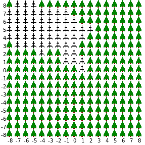

[Programação Paralela](https://github.com/AndreaInfUFSM/elc139-2018a) > Trabalhos

# T5: Aplicação do Método de Monte Carlo em OpenMP

## Introdução

O termo ["método de Monte Carlo"](https://en.wikipedia.org/wiki/Monte_Carlo_method) refere-se a uma abordagem para calcular soluções aproximadas para problemas numéricos em diversas áreas. A principal característica deste tipo de método é o emprego de amostras de números aleatórios (ou pseudo-aleatórios) para representar valores de variáveis envolvidas em algum fenômeno. Em geral, as aplicações do método de Monte Carlo são computacionalmente intensivas, pois é necessário repetir experimentos com diversas amostras de números para se fazer alguma análise estatística.

A aplicação escolhida para este trabalho utiliza um método de Monte Carlo para simular **incêndios em florestas**. Esta aplicação utiliza um modelo simples em que o fogo se propaga de uma árvore para outra com uma dada probabilidade. A cada execução da aplicação, realiza-se vários experimentos com diferentes probabilidades de propagação do fogo. Na saída, tem-se o percentual de árvores queimadas para cada probabilidade de propagação considerada. Na figura ao lado, é ilustrada a propagação para uma única probabilidade (imagem meramente ilustrativa, pois o programa a ser paralelizado não tem interface gráfica).

Devido ao número de experimentos, uma execução desta aplicação pode consumir um tempo significativo. Assim, o objetivo deste trabalho é paralelizar esta aplicação buscando diminuir seu tempo de processamento em uma arquitetura paralela **multicore**, usando OpenMP.

## Desenvolvimento

1. Este trabalho pode ser feito **em dupla ou individualmente**.

2. Para começar, obtenha uma cópia de [firesim.tar.gz](firesim.tar.gz), que contém o programa sequencial de referência para este trabalho.

3. Teste o programa sequencial com difentes parâmetros de entrada. Analise o código e identifique oportunidades de paralelismo, considerando a arquitetura paralela alvo.

4. Projete **duas soluções** paralelas para o programa em questão e implemente-as usando OpenMP. Você pode, por exemplo, variar as estratégias de particionamento, de escalonamento, etc.

5.  Para avaliar o desempenho dos programas, será necessário medir os tempos de execução sequencial e paralela para diferentes configurações do problema (mínimo 3: um problema grande, um médio e um pequeno), e com diferentes números de threads. Utilize a mesma técnica de medição de tempos para os dois programas.

## Entrega

No seu repositório da disciplina, na pasta `trabalhos/t5`, crie um documento `Entrega.md`, contendo:
 - Identificação completa da disciplina e do(s) aluno(s);
 - Links para os códigos desenvolvidos;
 - Link para **slides** explicando as estratégias de paralelização adotadas, descrevendo os experimentos realizados e discutindo os resultados obtidos;
 - Referências.

**Atenção:** Trabalhos feitos em dupla deverão constar nos repositórios de ambos os integrantes, do contrário serão avaliados como trabalhos individuais.

## Material de apoio

- [Interactivate: Fire!!](http://www.shodor.org/interactivate/activities/Fire/)  
Programa interativo que ilustra a propagação de incêndio em uma floresta via um modelo probabilístico (não é o programa a ser paralelizado).

- [Tutorial OpenMP](https://computing.llnl.gov/tutorials/openMP/)  
  Tutorial do Lawrence Livermore National Laboratory (LLNL) sobre OpenMP.
