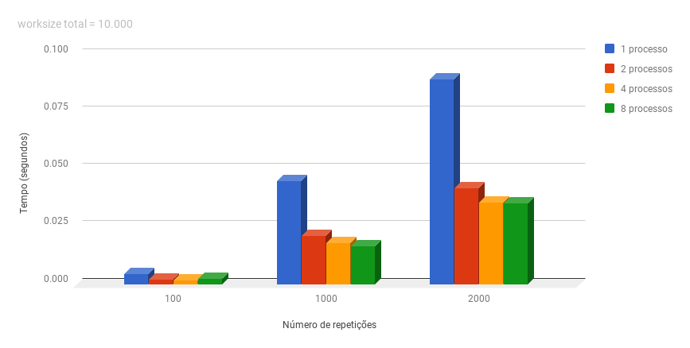
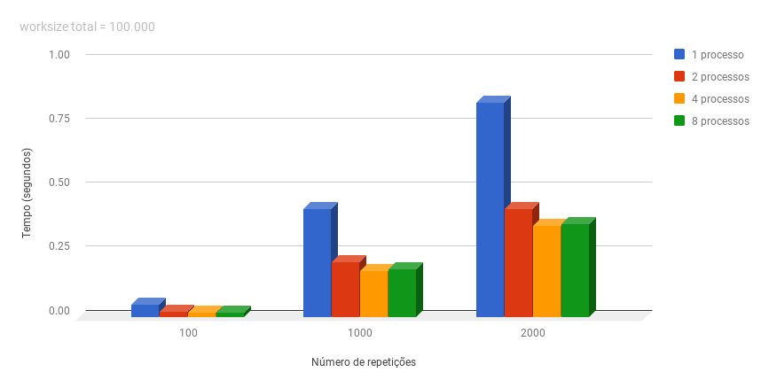
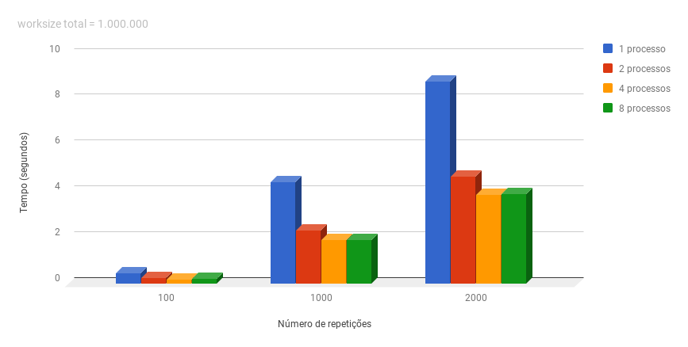
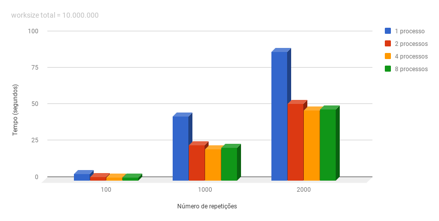
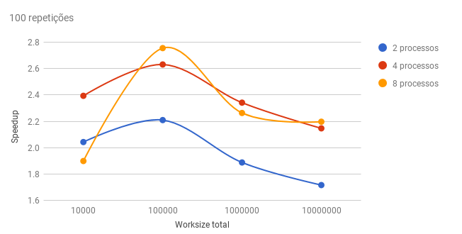
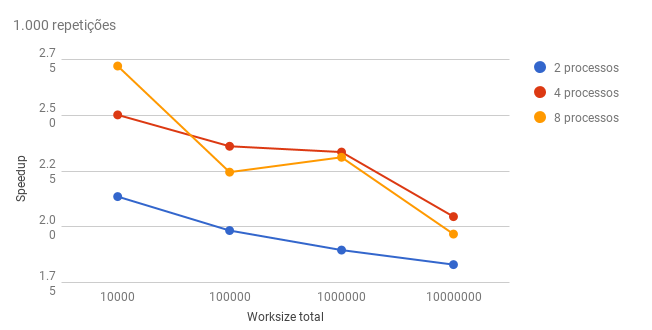
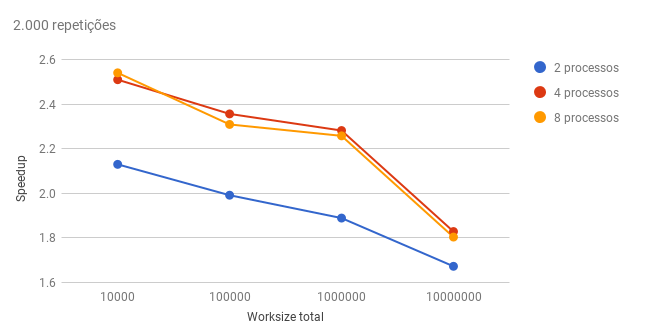

[Programação Paralela](https://github.com/AndreaInfUFSM/elc139-2018a) > Trabalhos

# T7: Primeiros passos com MPI

Disciplina: ELC139 - Programação Paralela <br/>
Aluno: Rhauani Weber Aita Fazul

## Sumário

- [Parte 1](#parte-1)
	- [Produto escalar com MPI](#produto-escalar-com-mpi)
	- [Desempenho](#desempenho)
	- [_Speedup_](#speedup)
- [Parte 2](#parte-2)
	- [_Pipeline_ de mensagens com MPI](#pipeline-de-mensagens-com-mpi)
- [Parte 3](#parte-3)
	- [Primeiro progama](#primeiro-programa)
	- [Segundo programa](#segundo-programa)
- [Referências](#referências)

<!-- PARTE 1 -->
## Parte 1

### Produto escalar com MPI
+ Implemente uma versão em MPI do programa do trabalho [t3](../t3), que calcula repetidas vezes o produto escalar entre 2 vetores. Os argumentos do programa devem ser: o número de elementos para cada processo e o número de repetições.

O programa [mpi_dotprod.c](mpi/mpi_dotprod.c) utiliza MPI para realizar o cálculo do produto escalar. Uma das mudanças realizadas em comparação ao código do trabalho [t3](../t3) diz respeito a forma com que os dois vetores ('a' e 'b') são alocados.

O tamanho dos vetores nos programas [openmp_dotprod.c](../t3/openmp/openmp_dotprod.c) e [pthreads_dotprod.c](../t3/pthreads_dotprod/pthreads_dotprod.c) é relacionado ao número de _threads_ utilizadas, seguindo a lógica:

``` c
   dotdata.a = (double *) malloc(wsize * nthreads * sizeof(double));
   dotdata.b = (double *) malloc(wsize * nthreads * sizeof(double));
```

Desta forma é possível realizar uma divisão de carga entre as _threads_, de modo que cada _thread_ atue em seu intervalo específico (baseado em seu identificador). Já no programa com MPI isto não é necessário, pois tendo em vista que cada processo tem suas próprias copias de cada variável do programa, os vetores podem ser alocados baseados apenas no _worksize_ do problema (cada processo atua da posição 0 à N-1 de cada vetor), como pode ser visto a seguir.

``` c
    dotdata.a = (double*) malloc(wsize * sizeof(double));
    dotdata.b = (double*) malloc(wsize * sizeof(double));
```

Com isto em mente, o programa [mpi_dotprod.c](mpi/mpi_dotprod.c) foi implementado. Ele pode ser compilado utilizando o arquivo [_Makefile_](mpi/Makefile) com:

``` make
	$ make
```

Ou utilizando diretamente o comando:

``` bash
	$ mpicc -o mpi_dotprod mpi_dotprod.c -Wall
```

Os argumentos para execução do programa são o _worksize_ do problema e a quantidade de repetições a serem realizadas. A opção para determinar o número de processos também deve ser utilizada no momento da execução. Logo, para executar pode-se utilizar um dos seguintes comandos:

``` bash
	$ mpiexec -np <numero de processos> mpi_dotprod <worksize> <repetitions> 
	// OU
	$ mpirun -np <numero de processos> mpi_dotprod <worksize> <repetitions>
```

Um exemplo de saída pode ser visto a seguir:


``` 
	$ mpiexec -np 4 mpi_dotprod 250000 2000
	dot product: 10000.000000
	the result is correct
	number of processes: 4, wall time: 3897591 usec, wall time MPI: 3897588.968277 usec
```

A linha que informa a situação do resultado é apenas uma verificação extra feita pela função _check\_result()_. As duas informações relacionadas ao tempo são, respectivamente, obtidas por meio das funções _gettimeofday()_, pertencente a biblioteca _sys/time.h_, e _MPI\_Wtime()_,  que foi projetada para ser um _elapsed/wall clock_ de alta resolução, pertencente as rotinas de gerenciamento de ambiente do MPI. Perceba que seus resultados são similares.

**Importante:** Note que neste programa o processo 'master' (_rank_ = 0) também executa o cálculo do produto escalar.

### Desempenho
+ Avalie o desempenho do programa conforme as instruções do trabalho [t3](../t3), mas usando processos ao invés de threads.

Primeiramente é importante ressaltar que, com MPI, o parâmetro referente ao tamanho dos vetores foi utilizado com base no número de processos. Para exemplificar, a execução com único processo e _worksize_ = 1.000.000 equivale a seguinte execução com dois processos:

``` bash
	$ mpiexec -np 2 mpi_dotprod 500000 100
```

Se, por exemplo, fosse utilizado _np_ = 4, o _worksize_ precisaria ser recalculado:
 
``` bash
	$ mpiexec -np 4 mpi_dotprod 250000 100
```

Sendo assim, _worksize_(processo<sub><i>i</i></sub>) = <i>worksize</i><sub>total</sub> &divide; _np_. Esse cuidado foi tomado em todas baterias de testes realizadas com múltiplos processos. 

Abaixo estão ilustrando os valores médios (em segundos) de cada execução, para obtenção desses valores foram realizadas 30 execuções de cada  configuração de teste, onde foi realizada uma média aritimética simples dos tempos de execução individual, em que: _T(s)_ = (&Sigma;<sub><i>n</i>=1..30</sub> T<sub>n</sub>) &divide; 30. 

O _script_ [_mpi_dotprod_calcTime.sh_](mpi/mpi_dotprod_analysis/mpi_dotprod_calcTime.sh) foi utilizado para realizar as execuções e calcular as médias de tempo apresentadas a seguir.


- (MPI) Tempos de execução em segundos com 2 processos:

| <i>worksize</i><sub>total</sub>  | 100 repetições  | 1.000 repetições | 2.000 repetições |
| ---------- | ---------------- | ---------------- | ---------------- |
| 10.000     | 0.0022468408	| 0.0210976124	   | 0.0419705391     |
| 100.000    | 0.0218290806	| 0.2134095033	   | 0.4213205417     |	
| 1.000.000  | 0.2375040213	| 2.3343317191	   | 4.6773656905     |
| 10.000.000 | 2.5732222319	| 24.090258539	   | 52.686243375     |

- (MPI) Tempos de execução em segundos com 4 processos:

| <i>worksize</i><sub>total</sub>  | 100 repetições  | 1.000 repetições | 2.000 repetições |
| ---------- | ---------------- | ---------------- | ---------------- |
| 10.000     | 0.0019173861	| 0.0180084229	   | 0.0356212616     |
| 100.000    | 0.0183288415	| 0.1792565346     | 0.3561256726     |	
| 1.000.000  | 0.1914577166	| 1.8949890455     | 3.8727197945     |
| 10.000.000 | 2.0571046193	| 21.556784201     | 48.194262346     |


- (MPI) Tempos de execução em segundos com 8 processos:

| <i>worksize</i><sub>total</sub>  | 100 repetições  | 1.000 repetições | 2.000 repetições |
| ---------- | ---------------- | ---------------- | ---------------- |
| 10.000     | 0.0024171591	| 0.0165581166     | 0.0351903041     |
| 100.000    | 0.0175017676	| 0.1885229905     | 0.3634130955     |	
| 1.000.000  | 0.1980914672	| 1.9141737143     | 3.9135585427     |
| 10.000.000 | 2.0100605090	| 22.413953114	   | 48.856362343     |

Com base nesses resultados, os seguintes gráficos podem ser gerados para facilitar a visualização:

- Desempenho do programa variando o número de processos e repetiçoes com <i>worksize</i><sub>total</sub> de 10.000:

<p align="center">
  
</p>

- Desempenho do programa variando o número de processos e repetiçoes com <i>worksize</i><sub>total</sub> de 100.000:

<p align="center">
  
</p>


- Desempenho do programa variando o número de processos e repetiçoes com <i>worksize</i><sub>total</sub> de 1.000.000:

<p align="center">
  
</p>

- Desempenho do programa variando o número de processos e repetiçoes com <i>worksize</i><sub>total</sub> de 10.000.000:

<p align="center">
  
</p>

Percebe-se que o uso do MPI trouxe um aumento de desempenho significável. Ao contrário do que esperava-se, mesmo utilizando um número de processos maior que o número de processadores/núcleos da máquina onde os testes foram realizados, houve aumento de desempenho em alguns casos.

Acredita-se que o _overhead_ gerado na criação e na gerência dos procesos seja diluído por outros fatores do programa. Como exemplo, os vetores 'a' e 'b' utilizados para o cálculo do produto escalar que, conforme apresentado anteriormente, são alocados de acordo com o tamanho do _worksize_. Desta forma, ao utilizar um número maior de processos (_worksize_(processo<sub><i>i</i></sub>) = <i>worksize</i><sub>total</sub> &divide; _np_), realizam-se alocações menores, que podem vir a trazer alguma otimização no uso da memória, seja na _heap_ de cada processo ou, até mesmo, na cache.

### _Speedup_

Para calcular o _Speedup_, utilizou-se como base os tempos de uma execução sequencial de único processo (<i>t<sub>s</sub></i>).

- Tempos de execução em segundos com 1 único processo:

| <i>worksize</i><sub>total</sub>  | 100 repetições  | 1.000 repetições | 2.000 repetições |
| ---------- | ---------------- | ---------------- | ---------------- |
| 10.000     | 0.0045891000	| 0.045054700	   | 0.089399700      |
| 100.000    | 0.0482262667	| 0.423254800	   | 0.839144000      |
| 1.000.000  | 0.4483052330	| 4.425085300	   | 8.836428200      |
| 10.000.000 | 4.4157576670	| 44.09700233	   | 88.13792133      |


Sendo assim, o fator de aceleração (_speedup_) pode ser calculado da seguinte maneira:
<p align="center"></p>

Onde _p_ equivale a quantidade de processadores, <i>t<sub>s</sub></i> equivale ao tempo de execução serial e <i>t<sub>p</sub></i> ao tempo de execução paralelo.

As tabelas a seguir representam o _speedup_ alcançado com MPI. Para cada um dos cenários, utilizou-se as médias de tempo apresentadas na seção de <a href="#desempenho">Desempenho</a>.

- (MPI) _Speedup_ obtido com 2 processos:

| <i>worksize</i><sub>total</sub>  | 100 repetições  | 1.000 repetições | 2.000 repetições |
| ---------- | ---------------- | ---------------- | ---------------- |
| 10.000     | 2.0425 		| 2.1355	   | 2.1301 	      |
| 100.000    | 2.2093 		| 1.9833 	   | 1.9917           |	
| 1.000.000  | 1.8876 		| 1.8957 	   | 1.8892           |
| 10.000.000 | 1.7160 		| 1.8305	   | 1.6729 	      |

- (MPI) _Speedup_ obtido com 4 processos:

| <i>worksize</i><sub>total</sub>  | 100 repetições  | 1.000 repetições | 2.000 repetições |
| ---------- | ---------------- | ---------------- | ---------------- |
| 10.000     | 2.3934 		| 2.5019	   | 2.5097 	      |
| 100.000    | 2.6312 		| 2.3612	   | 2.3563           |	
| 1.000.000  | 2.3415 		| 2.3352	   | 2.2817           |
| 10.000.000 | 2.1466 		| 2.0456 	   | 1.8288           |


- (MPI) _Speedup_ obtido com 8 processos:

| <i>worksize</i><sub>total</sub>  | 100 repetições  | 1.000 repetições | 2.000 repetições |
| ---------- | ---------------- | ---------------- | ---------------- |
| 10.000     |	1.8986   	| 2.7210 	   | 2.5405	      |
| 100.000    |	2.7555  	| 2.2451	   | 2.3091	      |	
| 1.000.000  |	2.2631  	| 2.3117 	   | 2.2579           |
| 10.000.000 |	2.1968  	| 1.9674 	   | 1.8040           |

Com estes resultados pode-se gerar os seguintes gráficos:

- Aceleração obtida nos testes considerando 100 repetições do cálculo do produto escalar:

<p align="center">
  
</p>

- Aceleração obtida nos testes considerando 1.000 repetições do cálculo do produto escalar:

<p align="center">
  
</p>

- Aceleração obtida nos testes considerando 2.000 repetições do cálculo do produto escalar:

<p align="center">
  
</p>

O MPI apresentou um _Speedup_ maior que o esperado. Até mesmo quando comparado aos valores de aceleração obtidos em [t3](../t3/Entrega.md) (com _Pthreads_ e com OpenMP), percebe-se situações em que seu desempenho foi superior. 

Conforme citado anteriormente, isto pode estar relacionado ao contexto específico do programa _mpi\_dotprod_ e a forma como este foi implementado. Algumas questões ficam em aberto para estudos futuros, como por exemplo, formas de visualizar a fundo como o MPI realiza a criação dos processos, levando em consideração as ténicas de otimização realizadas, tais como CoW (_Copy-on-write_).

<!-- PARTE 2 -->
## Parte 2

### _Pipeline_ de mensagens com MPI
+ Implemente um programa MPI que transporte uma mensagem em um _pipeline_ formado por processos de 0 a NP-1 (processo 0 envia para 1, processo 1 envia para 2, ..., processo NP-1 mostra o resultado). A mensagem é um número inteiro que é incrementado antes de ser passado adiante.

O programa [mpi_pipeline.c](mpi/mpi_pipeline.c) implementa a lógica deste _pipeline_. A execução é dada pelo comando:

``` bash
	$ mpiexec -np <numero de processos no pipeline> mpi_pipeline
```

A saída do programa varia em função da definição da macro _PRINT\_TRACE_. Caso esta macro não esteja definida o _output_, será o seguinte:

```
	$ mpiexec -np 5 mpi_pipeline
	*** Pipeline de 5 processos (msg inicia em 0) ***
	
	[FIM] Processo 4 obteve o resultado 3
```

Caso contrário, toda a comunicação será detalhada:

```
	$ mpiexec -np 5 mpi_pipeline

	*** Pipeline de 5 processos (msg inicia em 0) ***

	-- Verbose mode (PRINT_TRACE esta definido) --
	
	Processo [0] envia mensagem para Processo [1]. Msg = 0
		-> Processo [1] recebe mensagem do Processo [0]. Msg = 0
	Processo [1] envia mensagem para Processo [2]. Msg = 1
		-> Processo [2] recebe mensagem do Processo [1]. Msg = 1
	Processo [2] envia mensagem para Processo [3]. Msg = 2
		-> Processo [3] recebe mensagem do Processo [2]. Msg = 2
	Processo [3] envia mensagem para Processo [4]. Msg = 3
		-> Processo [4] recebe mensagem do Processo [3]. Msg = 3
	[FIM] Processo 4 obteve o resultado 3
```

Perceba que as impressões do _trace_ podem vir a ocorrerem em ordem invertida. A especificação do MPI não determina como a saída padrão de diferentes processos devem ser coletadas para serem exibidas no processo inicial da execução (o console). Quando múltiplos processos tentam realizar suas impressões o _output_ pode acabar ficando misturado de uma forma não especificada. 

Isto não ocorre por erros na comunicação entre os processos e sim pelo fato de que múltiplos processadores podem realizar seus respectivos _outputs_ no console ao mesmo tempo e, um atraso na _pool_ pode vir a inverter a ordem das impressões. Ainda assim, na maioria das vezes, a saída obtida será similiar ao _trace_ apresentado anteriormente, estando de acordo com o esperado.

<!-- PARTE 3 -->
## Parte 3

### Primeiro programa
+ O programa [mpi_errado1.c](examples/mpi_errado1.c) deveria realizar a troca de mensagens entre 2 processos, mas ele não funciona como esperado. Identifique o erro e corrija-o.

O erro está relacionado aos identificadores das mensagens - conhecidos como _tags_ - utilizados nas chamadas das rotinas _MPI\_Send()_ e _MPI\_Recv()_ que servem para distinguir as mensagens de um mesmo processo. A correção pode ser vista no programa [mpi_certo1.c](mpi/mpi_certo1.c). 

### Segundo programa
+ O programa [mpi_errado2.c](examples/mpi_errado2.c) deveria realizar a troca de mensagens entre 2 processos, mas também não funciona como esperado. Identifique o erro e corrija-o.

A rotina _MPI\_Finalize()_ deve ser chamada em todo programa MPI, ou seja, todos os procesos devem chamá-la antes de seu término. O programa [mpi_certo2.c](mpi/mpi_certo2.c) implementa esta correção.

<!-- REFERÊNCIAS -->
## Referências 
- Andrew Lumsdaine, et. al. <i>Open MPI Tutorial</i>. https://goo.gl/uvoVtZ
- Carsten Kutzner. <i>Getting started with MPI</i>. https://goo.gl/uQytho
- FSU - Department of Scientific Computing. <i>MPI: C Examples</i>. https://goo.gl/5KsMJB
- Lawrence Livermore National Laboratory. <i>Message Passing Interface (MPI)</i>. https://goo.gl/ArAH3v
- MPICH. <i>MPI_Wtime</i>. https://goo.gl/uhGx9N
- MPI Forum. <i>MPI: A Message-Passing Interface Standard</i>. https://goo.gl/Q1LR4s
- MPI Forum. <i>Startup</i>. https://goo.gl/qKepZn
- MPI Tutorial. <i>MPI Send and Receive</i>. https://goo.gl/bCbXY2
- Open MPI. <i>Open MPI Documentation</i>. https://goo.gl/WLCJ7M
- Peter S. Pacheco. <i>A User's Guide to MPI</i>. https://goo.gl/A1KDz7 
- University of Kansas. <i>An introduction to the Message Passing Interface (MPI) using C</i>. https://goo.gl/mA1NuV
- Wikipedia. <i>Message Passing Interface</i>. https://goo.gl/RZz9hA
- Willam Gropp. <i>Tutorial on MPI: The Message-Passing Interface</i>. https://goo.gl/C2LYNc
