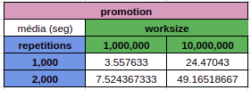
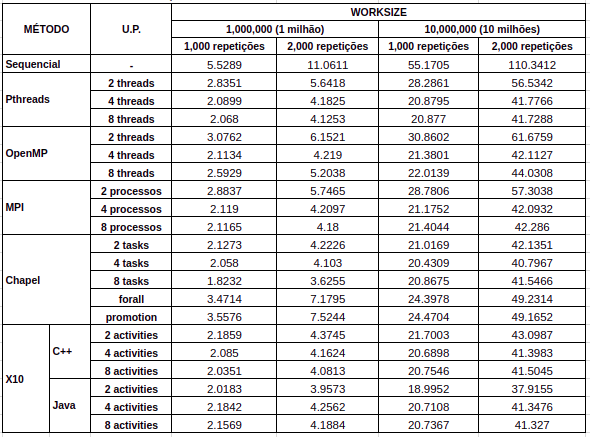

[Programação Paralela](https://github.com/AndreaInfUFSM/elc139-2018a) > Trabalhos

# Trabalho final: Chapel e X10

Disciplina: ELC139 - Programação Paralela <br/>
Aluno: Rhauani Weber Aita Fazul

## Sumário

- [Chapel](#chapel)
	- [O que é Chapel?](#lp-chapel)
	- [Instalação](#chapel-install)
	- [Compilação e execução](#chapel-exec)
- [X10](#x10)
	- [O que é X10?](#lp-x10)
	- [Instalação](#x10-install)
	- [Compilação e execução](#x10-exec)
- [Análise: _dot product_](#analise)
	- [Desempenho](#desempenho)
		- [Sequencial](#sequencial)
		- [Pthreads](#pthreads)
		- [OpenMP](#openmp)
		- [MPI](#mpi)
		- [Chapel](#dotprod-chapel)
		- [X10](#dotprod-x10)
	- [Comparação](#comparacao)
		- [_Speedup_](#speedup)
- [Referências](#referências)

<!-- CHAPEL -->
# Chapel

<a name="lp-chapel"></a>
## O que é Chapel?

Uma lingaguem de programação paralela moderna (e _open-souce_) baseada em Java, C/C++, Python e Matlab. Visa aumentar a produtividade no desenvolvimento de programas concorrentes e paralelos (vários tipos de paralelismo em um único programa de maneira simples), sendo portável (roda em notebooks com diferentes SOs, _clusters_, _cloud_ e sistemas de HPC) e escalável (e.g. sistemas de memória distribúida). 

<a name="chapel-install"></a>
## Instalação

Baseado no [guia oficial](https://chapel-lang.org/docs/usingchapel/QUICKSTART.html) de instalação:

+ Alguns pré-requisitos básicos podem ser vistos [aqui](https://chapel-lang.org/docs/usingchapel/prereqs.html#readme-prereqs) (a maioria são pacotes básicos que muitas distribuições _Unix-like_ já possuem por _default_).

+ O download do _.tar_ contendo o código fonte pode ser feito [aqui](https://chapel-lang.org/download.html) (atualmente na versão 1.17.1).

Em seguida:
 
``` bash
	$ tar -xzf chapel-1.17.1.tar.gz && cd chapel-1.17.1 && source util/quickstart/setchplenv.bash
```

O _build_ e a verificação da instalação são realizados com um arquivo Makefile:

``` bash
	$ make && make check
```

Se tudo ocorreu conforme esperado, a seguinte mensagem será exibida: "SUCCESS: 'make check' passed!".

<a name="chapel-exec"></a>
## Compilação e execução

Básico:

``` bash
	$ chpl -o file file.chpl
	$ ./file
```

- Compilar com a flag '<em>--fast</em>' ativa uma série de otimizações;
- Se no programa estiver definido uma variável de configuração (ex. <em>config const name = "value";</em>), é possível setá-la com novos valores:
	
``` bash
	$ ./file --name="novoValor"
``` 

<!-- X10 -->
# X10

<a name="lp-x10"></a>
## O que é X10?

<a name="x10-install"></a>
## Instalação


<a name="x10-exec"></a>
## Compilação e execução


<!-- ANALISE -->
<a name="analise"></a>
# Análise: _dot product_

Para realizar a análise, foram realizados testes de performance de diferentes ferramentas de programação paralela no cálculo do produto escalar com repetições. Os programas recebem como parâmetros o número de unidades de paralelização (quando aplicado), o _worksize_ total (este valor é dividido entre as _N_ unidades de paralelização, diferentemente de outras versões do programa utilizados nos trabalhos anteriores) e o número de repetições do cálculo do produto escalar a serem realizadas. 

Desta forma, os seguintes casos de testes foram definidos { _worksize_, _repetitions_, [U.P.*] }.

- { 1.000.000, 1000, [1, 2, 4, 8] } 
- { 1.000.000, 2000, [1, 2, 4, 8] } 
- { 10.000.000, 1000, [1, 2, 4, 8] } 
- { 10.000.000, 2000, [1, 2, 4, 8] }

* No contexto deste trabalho, unidades de paralelização (U.P.s) englobam _threads_, processos, _tasks_ ou _activitites_.

## Desempenho

Para obtenção das médias foram realizadas 30 execuções de cada configuração de teste em um computador com a seguinte arquitetura de CPU:

<p align="center">
     
</p>

### Sequencial

- Código fonte: [sequential_dotprod.c](sequencial/sequential_dotprod.c)
- Compilação: [Makefile](sequencial/Makefile)
- _Scripts_ de teste:
	- [execute.sh](sequencial/execute.sh)
	- [run_tests_sequential.sh](sequencial/run_tests_sequential.sh)
- _Outputs_: [results](sequencial/results)
- Média dos resultados obtidos:

<p align="center">
     
</p>


### Pthreads

- Código fonte: [pthreads_dotprod.c](pthreads/pthreads_dotprod.c)
- Compilação: [Makefile](pthreads/Makefile)
- _Scripts_ de teste:
	- [execute.sh](pthreads/execute.sh)
	- [run_tests_pthreads.sh](pthreads/run_tests_pthreads.sh)
- _Outputs_: [results](pthreads/results)
- Média dos resultados obtidos com 2, 4 e 8 _threads_:

<p align="center">
     
</p>

### OpenMP

- Código fonte: [openmp_dotprod.c](openmp/openmp_dotprod.c)
- Compilação: [Makefile](openmp/Makefile)
- _Scripts_ de teste:
	- [execute.sh](openmp/execute.sh)
	- [run_tests_openmp.sh](openmp/run_tests_openmp.sh)
- _Outputs_: [results](openmp/results)
- Média dos resultados obtidos com 2, 4 e 8 _threads_:

<p align="center">
     
</p>

### MPI

- Código fonte: [mpi_dotprod.c](mpi/mpi_dotprod.c)
- Compilação: [Makefile](mpi/Makefile)
- _Scripts_ de teste:
	- [execute.sh](mpi/execute.sh)
	- [run_tests_mpi.sh](mpi/run_tests_mpi.sh)
- _Outputs_: [results](mpi/results)
- Média dos resultados obtidos com 2, 4 e 8 processos:

<p align="center">
     
</p>


<a name="dotprod-chapel"></a>
### Chapel

+ Versão 1:

<forall>

- Código fonte: [dot_prod_alt1.chpl](chapel/dot_prod_alt1.chpl)
- Compilação: [compile.sh](chapel/compile.sh)
- _Scripts_ de teste:
	- [execute.sh](chapel/execute.sh) (testes de todas as versões)
	- [run_tests_alt1.sh](chapel/run_tests_alt1.sh)
- _Outputs_: [results/alt1](chapel/results/alt1)
- Média dos resultados:

<p align="center">
     
</p>

+ Versão 2:

<promotion>

- Código fonte: [dot_prod_alt2.chpl](chapel/dot_prod_alt2.chpl)
- Compilação: [compile.sh](chapel/compile.sh)
- _Scripts_ de teste:
	- [execute.sh](chapel/execute.sh) (testes de todas as versões)
	- [run_tests_alt2.sh](chapel/run_tests_alt2.sh)
- _Outputs_: [results/alt2](chapel/results/alt2)
- Média dos resultados:

<p align="center">
     
</p>


+ Versão 3:

<ntasks>

- Código fonte: [dot_prod_ntasks.chpl](chapel/dot_prod_ntasks.chpl)
- Compilação: [compile.sh](chapel/compile.sh)
- _Scripts_ de teste:
	- [execute.sh](chapel/execute.sh) (testes de todas as versões)
	- [run_tests_ntasks.sh](chapel/run_tests_ntasks.sh)
- _Outputs_: [results/ntasks](chapel/results/ntasks)
- Média dos resultados com 2, 4 e 8 _tasks_:

<p align="center">
     
</p>


<a name="dotprod-x10"></a>
### X10

+ C++ _backend_:

- Código fonte: [DotProd.x10](x10/DotProd.x10)
- Compilação: [compile_c++.sh](x10/compile_c++.sh)
- _Scripts_ de teste:
	- [execute.sh](chapel/execute.sh) (testes de todas as versões)
	- [run_tests_c++.sh](x10/run_tests_c++.sh)
- _Outputs_: [results/c++](x10/results/c++)
- Média dos resultados com 2, 4 e 8 _activities_:

<p align="center">
     
</p>


+ Java _backend_:

- Código fonte: [DotProd.x10](x10/DotProd.x10)
- Compilação: [compile_java.sh](x10/compile_java.sh)
- _Scripts_ de teste:
	- [execute.sh](chapel/execute.sh) (testes de todas as versões)
	- [run_tests_java.sh](x10/run_tests_java.sh)
- _Outputs_: [results/java](x10/results/java)
- Média dos resultados com 2, 4 e 8 _activities_:

<p align="center">
     
</p>

<a name="comparacao"></a>
## Comparação

<p align="center">
     
</p>


### Speedup

<p align="center">
     
</p>


Mais em: [analise-dotprod.pdf](analise/analise-dotprod.pdf) e [analise-dotprod.ods](analise/analise-dotprod.ods).

# Referências
- Pthreads
	+
	+
	+
- OpenMP
	+
	+
	+
- MPI
	+
	+
	+
- Chapel
	+
	+
	+
- X10
	+
	+
	+
