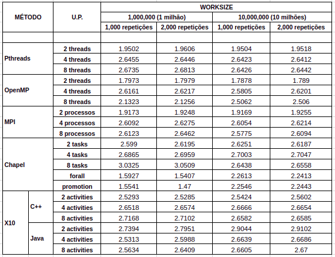

[Programação Paralela](https://github.com/AndreaInfUFSM/elc139-2018a) > Trabalhos

# Trabalho final: Chapel e X10

Disciplina: ELC139 - Programação Paralela <br/>
Aluno: Rhauani Weber Aita Fazul

## Sumário

- [Chapel](#chapel)
	- [O que é Chapel?](#lp-chapel)
	- [Instalação](#chapel-install)
	- [Compilação e execução](#chapel-exec)
- [X10](#x10)
	- [O que é X10?](#lp-x10)
	- [Instalação](#x10-install)
	- [Compilação e execução](#x10-exec)
- [Análise: _dot product_](#analise)
	- [Desempenho](#desempenho)
		- [Sequencial](#sequencial)
		- [Pthreads](#pthreads)
		- [OpenMP](#openmp)
		- [MPI](#mpi)
		- [Chapel](#dotprod-chapel)
		- [X10](#dotprod-x10)
	- [Comparação](#comparacao)
		- [_Speedup_](#speedup)
- [Referências](#referências)

<!-- CHAPEL -->
# Chapel

<a name="lp-chapel"></a>
## O que é Chapel?

Uma lingaguem de programação paralela moderna (e [_open-souce_](https://github.com/chapel-lang/chapel)) baseada em Java, C/C++, Python e Matlab. Visa aumentar a produtividade no desenvolvimento de programas concorrentes e paralelos (vários tipos de paralelismo em um único programa de maneira simples), sendo portável (executa em notebooks com diferentes SOs, _clusters_, _cloud_ e sistemas de HPC) e escalável (ex. sistemas de memória distribúida). 

<a name="chapel-install"></a>
## Instalação

Baseado no [guia oficial](https://chapel-lang.org/docs/usingchapel/QUICKSTART.html) de instalação:

+ Alguns pré-requisitos básicos podem ser vistos [aqui](https://chapel-lang.org/docs/usingchapel/prereqs.html#readme-prereqs) (a maioria são pacotes básicos que muitas distribuições _Unix-like_ já possuem por _default_).

+ O download do _.tar_ contendo o código fonte pode ser feito [aqui](https://chapel-lang.org/download.html) (atualmente na versão 1.17.1).

Em seguida:
 
``` bash
	$ tar -xzf chapel-1.17.1.tar.gz && cd chapel-1.17.1 && source util/quickstart/setchplenv.bash
```

O _build_ e a verificação da instalação são realizados com um arquivo Makefile:

``` bash
	$ make && make check
```

Se tudo ocorreu conforme o esperado, a seguinte mensagem será exibida: "SUCCESS: 'make check' passed!".

<a name="chapel-exec"></a>
## Compilação e execução

Básico:

``` bash
	$ chpl -o file file.chpl
	$ ./file
```

- Compilar com a flag '<em>--fast</em>' ativa uma série de otimizações;
- Se, no programa, for definido uma variável de configuração (ex. <em>config const name = "value";</em>), é possível setá-la com novos valores em tempo de execução:
	
``` bash
	$ ./file --name="novoValor"
``` 

<!-- X10 -->
# X10

<a name="lp-x10"></a>
## O que é X10?

Liguaguem orientada a objetos [_open-source_](https://github.com/x10-lang/x10) baseada em Java, projetada para programação paralela intensiva. Assim como Chapel, é portável e escalável, suportando computação _high-end_ com milhões de tarefas concorrentes. Mantém algumas características presentes no Java, como por exemplo checagem estática e _garbage collection_. É compilada para C++ ou Java.

<a name="x10-install"></a>
## Instalação

Duas formas principais, baseado no [guia oficial](http://x10-lang.org/releases/x10-release-261.html):

- Realizando o _download_ do [X10DT](http://x10-lang.org/software/download-x10/latest-release.html), uma IDE baseada no Eclipse com editor, compilador e _debugger_.

- Fazendo uso dos _pré-built_ binários disponíveis para algumas plataformas (ex. [Linux/x86_64](https://sourceforge.net/projects/x10/files/x10/2.6.1/x10-2.6.1_linux_x86_64.tgz/download) - opção escolhida para os testes). Atualmente a linguagem está no _release_ 2.6.1. 


<a name="x10-exec"></a>
## Compilação e execução

X10 possui duas implementações:

- C++ _backend_
	- Compilação AOT;
	- Otimizações mínimas para as funcionalidades O.O. da linguagem;
	- Permite escrita de código _low-level_ (maior controle/flexibilidade, mais esforço);
	- Compilando e executando:
	
``` bash
	$ bin/x10c++ -o file file.x10
	$ ./file
```

		- Compilar com a flag '-O' ativa algumas otimizações.
		
- Java _backend_
	- Tradução dinâmica (JIT);
	- Otimizações sofisticadas e serviçõs em tempo de execução para funcionalidades de O.O. da linguagem;
	- Implementada em uma JVM sem extensões (vanila), logo não consegue explorar algumas funcionalidades (ex. _workstealing_);
	- Compilando e executando:
``` bash
	$ bin/x10c file 
	$ bin/x10 file
```	

		- Onde 'file' possuí o mesmo nome do arquivo '.x10' (apenas sem a extensão).

Os desenvolvedores da linguaguem esperam tornar as implementações compatíveis entre si, de modo que, em um mesmo programa, existam partes que poderão ser executadas em Java e outras partes nativamente em C++.

<!-- ANALISE -->
<a name="analise"></a>
# Análise: _dot product_

Para realizar a análise, foram realizados testes de performance de diferentes ferramentas de programação paralela no cálculo do produto escalar com repetições. Os programas recebem como parâmetros o número de unidades de paralelização (quando aplicado), o _worksize_ total (este valor é dividido entre as _N_ unidades de paralelização, diferentemente de outras versões do programa utilizados nos trabalhos anteriores) e o número de repetições do cálculo do produto escalar a serem realizadas. 

Desta forma, os seguintes casos de testes foram definidos { _worksize_, _repetitions_, [U.P.*] }.

	- { 1.000.000, 1000, [1, 2, 4, 8] } 
	- { 1.000.000, 2000, [1, 2, 4, 8] } 

	- { 10.000.000, 1000, [1, 2, 4, 8] } 
	- { 10.000.000, 2000, [1, 2, 4, 8] }

\* No contexto deste trabalho, unidades de paralelização (U.P.s) englobam _threads_, processos, _tasks_ ou _activitites_.

## Desempenho

Para obtenção das médias foram realizadas 30 execuções de cada configuração de teste em um computador com a seguinte arquitetura de CPUs:

<p align="center">
     
</p>

Os testes foram aplicados nos seguintes contextos:

### Sequencial

- Código fonte: [sequential_dotprod.c](sequencial/sequential_dotprod.c)
- Compilação: [Makefile](sequencial/Makefile)
- _Scripts_ de teste:
	- [execute.sh](sequencial/execute.sh)
	- [run_tests_sequential.sh](sequencial/run_tests_sequential.sh)
- _Outputs_: [results](sequencial/results)
- Média dos resultados obtidos:

<p align="center">
     
</p>


### Pthreads

- Código fonte: [pthreads_dotprod.c](pthreads/pthreads_dotprod.c)
- Compilação: [Makefile](pthreads/Makefile)
- _Scripts_ de teste:
	- [execute.sh](pthreads/execute.sh)
	- [run_tests_pthreads.sh](pthreads/run_tests_pthreads.sh)
- _Outputs_: [results](pthreads/results)
- Média dos resultados obtidos com 2, 4 e 8 _threads_:

<p align="center">
     
</p>

### OpenMP

- Código fonte: [openmp_dotprod.c](openmp/openmp_dotprod.c)
- Compilação: [Makefile](openmp/Makefile)
- _Scripts_ de teste:
	- [execute.sh](openmp/execute.sh)
	- [run_tests_openmp.sh](openmp/run_tests_openmp.sh)
- _Outputs_: [results](openmp/results)
- Média dos resultados obtidos com 2, 4 e 8 _threads_:

<p align="center">
     
</p>

### MPI

- Código fonte: [mpi_dotprod.c](mpi/mpi_dotprod.c)
- Compilação: [Makefile](mpi/Makefile)
- _Scripts_ de teste:
	- [execute.sh](mpi/execute.sh)
	- [run_tests_mpi.sh](mpi/run_tests_mpi.sh)
- _Outputs_: [results](mpi/results)
- Média dos resultados obtidos com 2, 4 e 8 processos:

<p align="center">
     
</p>


<a name="dotprod-chapel"></a>
### Chapel

+ Versão 1:

Esta versão faz uso do _loop forall_. Este laço é uma variante paralela da construção comum _for_, sendo a principal forma para expressar paralelismo de dados em Chapel. O _loop forall_ pode usar um número arbitrário de tarefas (_tasks_) para executar as instruções dentro do laço, ou seja, pode vir a executar todas as iterações serialmente (única _task_) ou até mesmo vir a utilizar mais _tasks_ que o número de total de iterações (embora isso seja um evento incomum). 

Isso acontece pois o número real de _tasks_ usadas para executar o laço é determinado pela própria construção _forall_. Sua política de escalonamento, além de utilizar informações dinâmicas (tamanho do _loop_, número de CPUs/_cores_ disponíveis na máquina, etc.) para selecionar o número de _tasks_, também é responsável por determinar onde as _tasks_ serão executadas e como as iterações do laço serão divididas entre elas.

- Código fonte: [dot_prod_alt1.chpl](chapel/dot_prod_alt1.chpl)
- Compilação: [compile.sh](chapel/compile.sh)
- _Scripts_ de teste:
	- [execute.sh](chapel/execute.sh) (testes de todas as versões)
	- [run_tests_alt1.sh](chapel/run_tests_alt1.sh)
- _Outputs_: [results/alt1](chapel/results/alt1)
- Média dos resultados:

<p align="center">
     
</p>

+ Versão 2:

Este programa faz uso de _function promotion_ (ou simplesmente _promotion_), que é uma forma de paralelismo de dados implícito da linguagem Chapel.


- Código fonte: [dot_prod_alt2.chpl](chapel/dot_prod_alt2.chpl)
- Compilação: [compile.sh](chapel/compile.sh)
- _Scripts_ de teste:
	- [execute.sh](chapel/execute.sh) (testes de todas as versões)
	- [run_tests_alt2.sh](chapel/run_tests_alt2.sh)
- _Outputs_: [results/alt2](chapel/results/alt2)
- Média dos resultados:

<p align="center">
     
</p>


+ Versão 3:

As versões anteriores não permitem determinar um número exato de _tasks_ a serem criadas ao decorrer das iterações do laço. Pensando nisso, este programa utiliza a construção _coforall_, que cria uma _task_ distinta por iteração, permitindo controlar a quantidade de _tasks_ a serem usadas no cálculo.

- Código fonte: [dot_prod_ntasks.chpl](chapel/dot_prod_ntasks.chpl)
- Compilação: [compile.sh](chapel/compile.sh)
- _Scripts_ de teste:
	- [execute.sh](chapel/execute.sh) (testes de todas as versões)
	- [run_tests_ntasks.sh](chapel/run_tests_ntasks.sh)
- _Outputs_: [results/ntasks](chapel/results/ntasks)
- Média dos resultados com 2, 4 e 8 _tasks_:

<p align="center">
     
</p>


<a name="dotprod-x10"></a>
### X10

- C++ _backend_:

	- Código fonte: [DotProd.x10](x10/DotProd.x10)
	- Compilação: [compile_c++.sh](x10/compile_c++.sh)
	- _Scripts_ de teste:
		- [execute.sh](chapel/execute.sh) (testes de todas as versões)
		- [run_tests_c++.sh](x10/run_tests_c++.sh)
	- _Outputs_: [results/c++](x10/results/c++)
	- Média dos resultados com 2, 4 e 8 _activities_:

<p align="center">
     
</p>

- Java _backend_:

	- Código fonte: [DotProd.x10](x10/DotProd.x10) (mesmo código da versão em C++)
	- Compilação: [compile_java.sh](x10/compile_java.sh)
	- _Scripts_ de teste:
		- [execute.sh](chapel/execute.sh) (testes de todas as versões)
		- [run_tests_java.sh](x10/run_tests_java.sh)
	- _Outputs_: [results/java](x10/results/java)
	- Média dos resultados com 2, 4 e 8 _activities_:

<p align="center">
     
</p>

<a name="comparacao"></a>
## Comparação

As médias de desempenho (em segundos) podem ser vistas a seguir:

<p align="center">
     
</p>


### Speedup

<p align="center">
     
</p>


- Os dados completos podem ser vistos em: [analise-dotprod.pdf](analise/analise-dotprod.pdf) / [analise-dotprod.ods](analise/analise-dotprod.ods).

# Referências
- Pthreads
	- Lawrence Livermore National Laboratory. <i>POSIX Threads Programming</i>. https://goo.gl/AAWKW4
- OpenMP
	- Lawrence Livermore National Laboratory. <i>OpenMP</i>. https://goo.gl/o2wTxR
	- OpenMP. <i>OpenMP C and C++ Application Program Interface</i>. https://goo.gl/wPbQCn
	- OpenMP. <i>Summary of OpenMP 3.0 C/C++ Syntax</i>. https://goo.gl/VdvSpi
- MPI
	- Lawrence Livermore National Laboratory. <i>Message Passing Interface (MPI)</i>. https://goo.gl/ArAH3v
	- MPI Forum. <i>MPI: A Message-Passing Interface Standard</i>. https://goo.gl/Q1LR4s
	- Open MPI. <i>Open MPI Documentation</i>. https://goo.gl/WLCJ7M
- Chapel
	- Cray. Six Ways to Say “Hello” in Chapel. https://www.cray.com/blog/six-ways-to-say-hello-in-chapel-part-1/
	- Cray. Chapel. https://chapel-lang.org/presentations/ChapelForATPESC2016-presented.pdf
	- Cray. Chapel - History. https://chapel-lang.org/publications/PMfPC-Chapel.pdf
	- Chapel. The Chapel Parallel Programming Language. https://chapel-lang.org/
	- Chapel. Chapel Documentation. https://chapel-lang.org/docs/index.html
	- Chapel. Chapel Quick Reference. https://chapel-lang.org/docs/_downloads/quickReference.pdf
	- Chapel. Chapel Languague Specification. https://chapel-lang.org/docs/_downloads/chapelLanguageSpec.pdf
	- Wikipedia. Chapel (programming language). https://en.wikipedia.org/wiki/Chapel_(programming_language)
	- USP. Linguagem Chapel. https://www.ime.usp.br/~gold/cursos/2015/MAC5742/slides/Chapel.pdf
	- Walter Perez Urcia. Lingaugem Chapel. https://www.ime.usp.br/~gold/cursos/2015/MAC5742/reports/Chapel.pdf
- X10
	- X10. The X10 Programming Language. http://x10-lang.org/
	- X10. X10 Language Specification. http://x10.sourceforge.net/documentation/languagespec/x10-latest.pdf
	- PUC. Linguagens para Programaçãao Paralela. http://www.inf.puc-rio.br/~noemi/pcp-10/aula11-lpp.pdf
	- Wikipedia. X10 (programming language). https://en.wikipedia.org/wiki/X10_(programming_language)
